baseplotdemo
================

Making plots in R
-----------------

R is designed to make plots and visualize your data. That's one of the reasons I personally love it - you can always get something tangible out of your code.

### Let's start simple.

The most basic command in R is simply plot(). It takes two arguments, *x* and *y*, and draws a scatterplot with them:

``` r
x <- 1:10
y <- 1:10
plot(x, y)
```

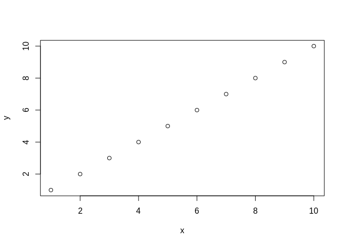

Simple, but boring. Scatterplots are often a good place to start, but data comes in many shapes and there are different visualization methods for all of them.

### Barplot

Rather than handling both x and y coordinates, all that barplot() needs is a *y* coordinate. It assumes that your *x* values will be 1:length(y) - basically assuming that each observation is "how many" of each category you observed.

``` r
y <- c(3,1,7,4,8,9,3,7,1)
barplot(y)
```

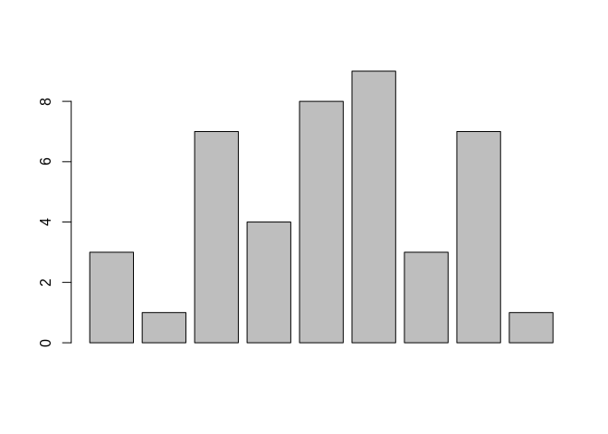

Note that histograms are **not** the same as boxplots. Histograms accept the raw data - no counting necessary - and plots the *frequency* of each datum. If you're unsure, use a barplot.

### Boxplot

Boxplots are another very common type of plot and are often close to publication quality immediately after creation. They accept a *matrix*, where the different columns are different treatments, each with several individual samples. The boxplot then provides the median and quartiles, giving a good idea of how the data is spread out.

``` r
nums <- rep(1:3, each=10)+rnorm(30, mean = 0, sd = 0.2)
print(nums)
```

    ##  [1] 0.7010741 0.9348459 1.2094831 1.1314954 1.3862508 1.0736691 1.2177507
    ##  [8] 1.2582649 0.8601741 1.0698459 1.9959368 2.3213321 1.8093023 2.1285337
    ## [15] 1.9783755 2.1118688 1.8734205 2.0721604 2.0854928 1.9689288 2.9942599
    ## [22] 3.3633250 3.3627041 3.1916157 2.6181297 2.8957451 3.1551999 3.1750330
    ## [29] 2.9366834 2.6450123

``` r
mat <- matrix(nums, ncol = 3, byrow = F)
print(mat)
```

    ##            [,1]     [,2]     [,3]
    ##  [1,] 0.7010741 1.995937 2.994260
    ##  [2,] 0.9348459 2.321332 3.363325
    ##  [3,] 1.2094831 1.809302 3.362704
    ##  [4,] 1.1314954 2.128534 3.191616
    ##  [5,] 1.3862508 1.978375 2.618130
    ##  [6,] 1.0736691 2.111869 2.895745
    ##  [7,] 1.2177507 1.873420 3.155200
    ##  [8,] 1.2582649 2.072160 3.175033
    ##  [9,] 0.8601741 2.085493 2.936683
    ## [10,] 1.0698459 1.968929 2.645012

``` r
boxplot(mat)
```

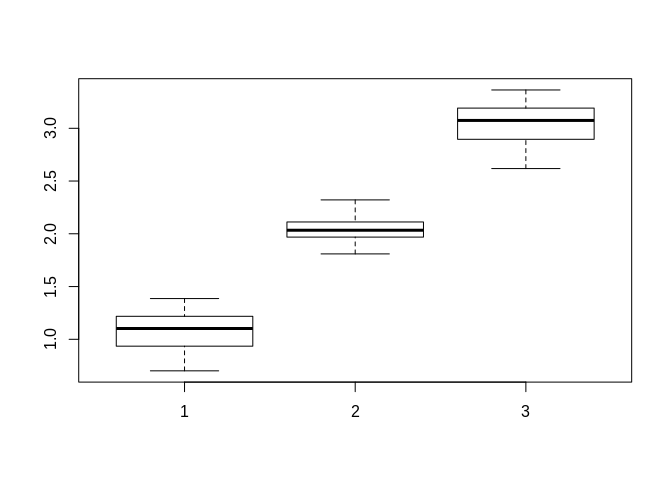

Prettifying plots
-----------------

R makes plots quickly, but also has a lot of options that let you make your plots beautiful and ready for actual publications. I'm going to step through some of the steps I usually use to make my plots look better, adding one layer at a time.

### Plotting things

I'm going to start with a scatterplot and build up from there.

``` r
plot(x = 1:20, y=rnorm(n = 20, mean = 5, sd = 2))
```

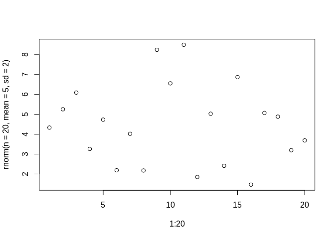

Note that R automatically assumes what you want the axes to be named based on the names of the variables you passed to the x and y arguments - here, it names the x axis "1:10" and the y axis "rnorm(n = 20, mean = 5, sd = 2)". Not very helpful, so let's change that around. We'll use the *ylab=* and *xlab=* arguments to change the axes.

``` r
plot(x = 1:20, y=rnorm(n = 20, mean = 5, sd = 2),
     xlab = "This is the x axis", ylab = "This is the y axis")
```

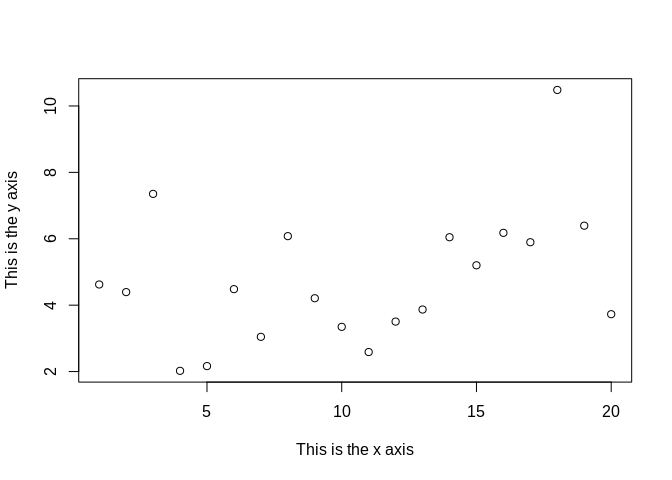

Better! At least now we know what we're talking about. Let's add a title and orient the axes more helpfully.

``` r
plot(x = 1:20, y=rnorm(n = 20, mean = 5, sd = 2),
     xlab = "This is the x axis", ylab = "This is the y axis",
     main = "This is the title", las=1) #las can be 1, 2, 3, or 4 - experiment!
```

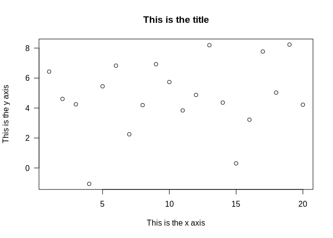

Looking good. Let's add some character to the plot, in the form of <sub>colors</sub> and <sub>shapes</sub> and <sub>sizes</sub>.

``` r
pointcolors <- rep(c("red", "blue"), each=10)
pointcolors
```

    ##  [1] "red"  "red"  "red"  "red"  "red"  "red"  "red"  "red"  "red"  "red" 
    ## [11] "blue" "blue" "blue" "blue" "blue" "blue" "blue" "blue" "blue" "blue"

``` r
pointshapes <- rep(0:3, length.out=20)
pointshapes
```

    ##  [1] 0 1 2 3 0 1 2 3 0 1 2 3 0 1 2 3 0 1 2 3

``` r
pointsizes <- sample(c(1:4), 20, replace = T)
pointsizes
```

    ##  [1] 1 1 3 3 3 4 1 3 2 2 4 2 2 4 2 3 3 2 2 1

``` r
plot(x = 1:20, y=rnorm(n = 20, mean = 5, sd = 2),
     xlab = "This is the x axis", ylab = "This is the y axis",
     main = "This is the title", las=1, #las can be 1, 2, 3, or 4 - experiment!
     col = pointcolors, pch=pointshapes, cex = pointsizes)
```

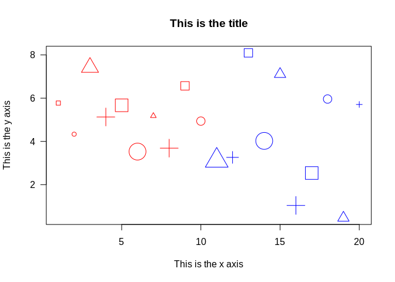

Okay, that's a little too crazy. Let's switch back to the base plot and instead add some new layers. Just remeber to experiment with shapes, colors, and sizes with all of the upcoming stuff as well.

Rather than plotting points only, we can also connect them if we want to show trends and variations in the data. There are two ways to do this - one, by building it into the base plot, and two - by adding a layer on top.

``` r
par(mfrow=c(1,3)) #Lets us display 3 graphs at the same time

plot(1:20, c(1:10, 10:1), main = "Simple plot")
plot(1:20, c(1:10, 10:1), main = "Built-in",
     type = "o") #type = "overlay" lines and points
plot(1:20, c(1:10, 10:1), main = "Extra layer")
lines(1:20, c(1:10, 10:1))
```

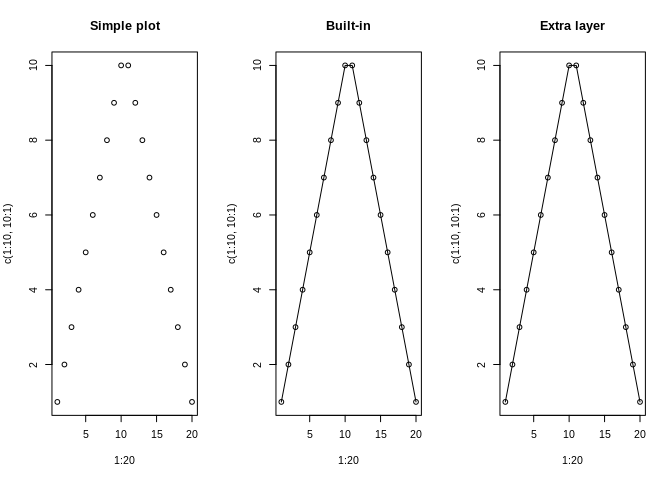

``` r
par(mfrow=c(1,1))
```

That "extra layer" is a pretty neat tool. It lets us add points and lines to our graphs wherever we want. "points" adds points, and each point needs an x and y, and you can add color and shape and size etc. "lines" adds lines, and needs a "start" x and y coordinate as well as an "end" x and y coordinate.

``` r
par(mfrow=c(1,2))

plot(x = 1:10, y = 1:10)

plot(x = 1:10, y = 1:10)
points(x = 1, y = 10) #Add a point at 1, 10
lines(c(10, 10)) #Draw a line from 1,10 to 2,10
```


``` r
par(mfrow=c(1,1))
```

### Cheatsheet so far:

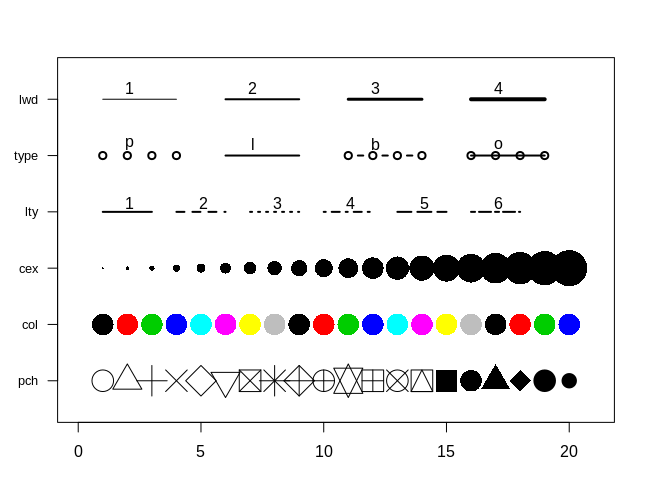

### Axes options

The axes are also an important part of the graph, but they've got their own settings so that you can manipulate them freely. I'll just list a bunch of options and you can experiment with them.

``` r
par(mfrow=c(2,3))

plot(1:10)
plot(1:10, axes = F, main = "No axes")
plot(1:10, xaxt="n", main = "No x axis") 
plot(1:10, main = "Standard, but created \nvia separate layer")
axis(side = 1, at = 1:10, labels = 1:10, tick = T, line = 0)

plot(1:10, main = "Colors and shapes", axes = F)
axis(side = 1, font = 2, col = "blue", cex.axis=4)
axis(side = 2, font = 3, col = "red")

plot(1:10, bty="7", main = "Box types")
```

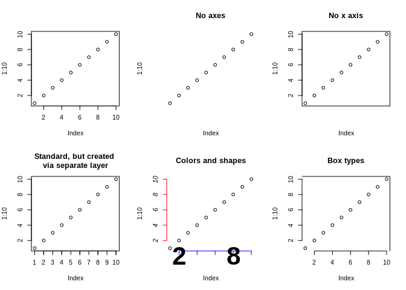

Working with some data!
-----------------------

Let's see what we can do with the LOBSTAHS data with this new plotting information.

``` r
LOBdata <- read.csv("~/Desktop/LOBsetPos.csv")

#Which columns are the data in?
datacols <- 12:29
compoundcol <- 43
speciescol <- 37
classcol <- 36
rtcol <- 5
mzcol <- 2

simpleLOBdata <- LOBdata[,c(36, 37, 43, 5, 2, 12:29)]
names(simpleLOBdata) <- c("Lipid_Class", "Lipid_Species", "Lipid_Compound", "Retention_time", "M/Z ratio",
                          paste("Sample", 1:18))

justSamples <- simpleLOBdata[,6:23]
```

We can check if any of the samples are outliers or unusual using a boxplot:

``` r
par(mar=c(5.1, 10.1, 2.1, 2.1))
tJustSamples <- log10(t(head(justSamples, 100)))
colnames(tJustSamples) <- simpleLOBdata$Lipid_Compound[1:100]
boxplot(tJustSamples, main = "What do the first 100 rows look like?",
        xlab = "Log base 10 of the intensity values", ylab="",
        horizontal=T, xlim=c(100,0), las=1, outcol="red", col="grey90")
```

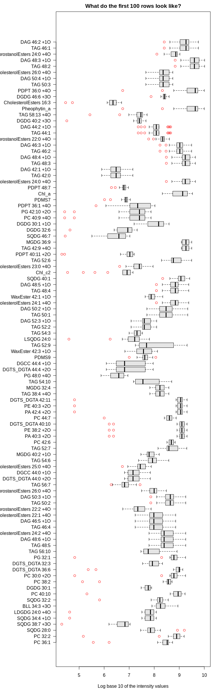
